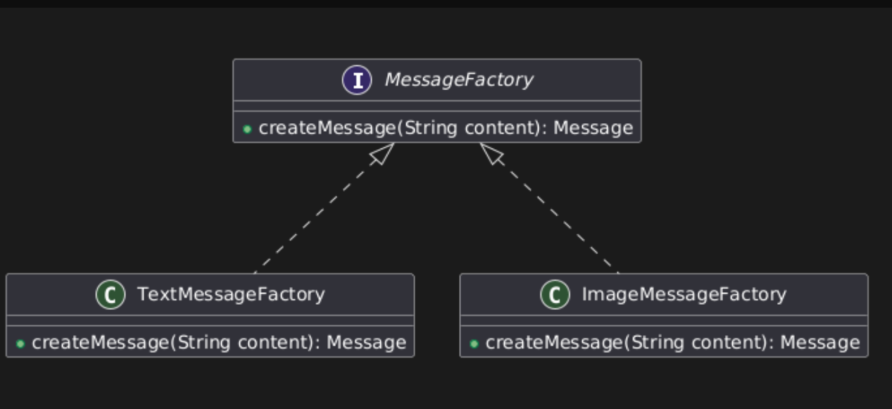
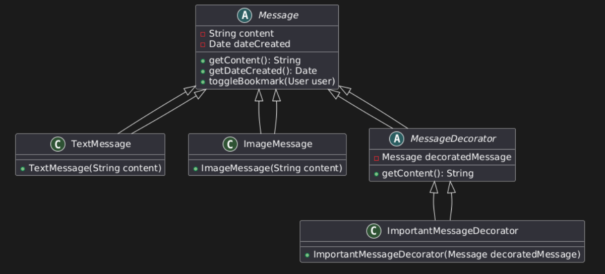
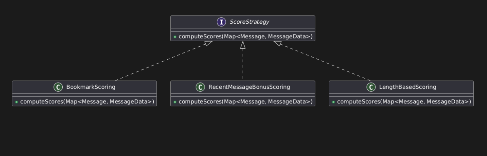
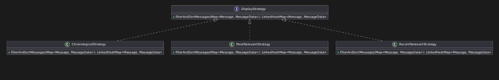
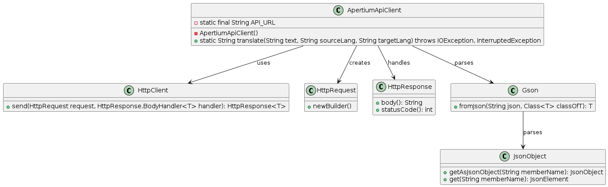
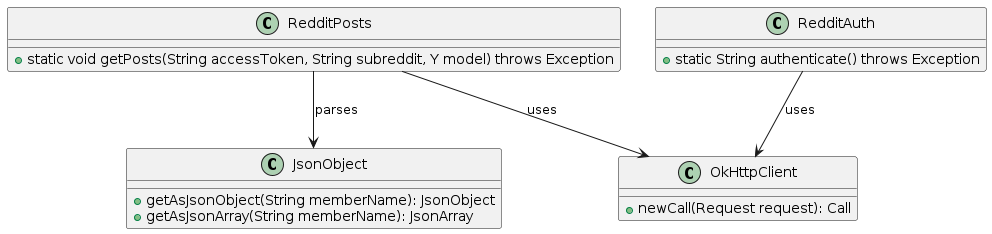

### **Introduction**
Le projet **"Y Microblogging"** est une plateforme permettant aux utilisateurs de publier, organiser et visualiser des messages. Ce projet, réalisé dans le cadre des Travaux Pratiques, suit une méthodologie itérative incluant des **design patterns**, des **tests automatisés**, et l'intégration de fonctionnalités avancées pour garantir la qualité et l'évolutivité du code.

PS : au lancement de l'application, il faudra se créer un nouveau utilisateur avant de se connecter (ou utiliser ceux déjà crée comme `test:test` ou `admin:admin`).

---

### **Fonctionnalités principales et architecture**
#### **Modèle (Model)**
- **`Message`** : Représente un message avec un contenu, une date de création et des métadonnées liées aux utilisateurs.  
- **`TextMessage` & `ImageMessage`** : Sous-classes de `Message` pour différencier les messages textuels et les images.  
- **`MessageData`** : Stocke les données spécifiques aux messages, comme les scores et l'état de bookmark.  
- **`MessageDecorator`** : Applique des modifications dynamiques aux messages. Exemple : `ImportantMessageDecorator` qui marque les messages comme "IMPORTANT".  
- **`ScoreStrategy`** : Interface permettant le calcul des scores pour les messages via des stratégies concrètes :
   - **`BookmarkScoring`** : Scoring basé sur les mots des messages bookmarkés.  
   - **`RecentMessageBonusScoring`** : Bonus de score pour les messages récents.  
   - **`LengthBasedScoring`** : Scoring en fonction de la longueur des messages.  
- **`DisplayStrategy`** : Interface pour filtrer et trier les messages :
   - **`ChronologicalStrategy`** : Affiche les messages par ordre chronologique.  
   - **`MostRelevantStrategy`** et **`RecentRelevantStrategy`** : Filtre les messages en fonction de leur score et de leur récence.  
- **`ApertiumApiClient`** : Intègre une API de traduction pour traduire le contenu des messages.  
- **`RedditPost`** et **`RedditAuth`** : Intègre une API de traduction pour importer des messages :
  - Authentification avec l'API Reddit pour obtenir un token d'accès OAuth2.
  - Récupération et traitement des posts d'un subreddit donné, avec attribution des auteurs et transformation en messages du modèle.
- **`DataInitializer`** : Charge les données initiales à partir d'un fichier JSON pour configurer les utilisateurs et les messages.

---

#### **Contrôleur (Controller)**
- **`MainController`** : Gère la logique métier et l’interaction entre les vues et le modèle, incluant :
   - **Publication de messages** : Ajout de messages via `TextMessageFactory` ou `ImageMessageFactory`.  
   - **Toggling Bookmark** : Permet aux utilisateurs de marquer/démarquer des messages.  
   - **Subscribe** : Possibilité de s'abonner (et désabonner) aux utilisateurs.
   - **Suppression de messages** : Suppression dynamique des messages pour une meilleure gestion.  
   - **Continuous Scrolling / LoadMoreMessages** : Chargement dynamique de nouveaux messages par lots pour améliorer l’expérience utilisateur.  
   - **Traduction des messages** : Appel API pour traduire un message en plusieurs langues.  

- **`TextMessageFactory` & `ImageMessageFactory`** : Implémentent le **Factory Method** pour créer les instances de messages appropriées.

---

#### **Vue (View)**
- **`JfxView`** : Gère l'affichage des messages avec des fonctionnalités interactives comme la publication, le filtrage, le scrolling continu et la traduction.  
- **`SignupWindow `** : Fenêtre d'inscription permettant aux utilisateurs de créer un compte. Les informations d'inscription sont enregistrées dans un fichier local. 
- **`LoginWindow `** : Fenêtre de connexion qui vérifie les identifiants des utilisateurs pour permettre l'accès à l'application.
---

### **Fonctionnalités avancées**
- **Scrolling continu** : Chargement progressif des messages pour améliorer l’ergonomie et la performance.  
- **Système de scoring** : Mise en place de stratégies multiples pour filtrer les messages pertinents.  
- **Traduction via API** : Utilisation d’Apertium API pour traduire les contenus textuels.  
- **Import de message via API** : Utilisation de l'API de Reddit pour importer des messages et des utilisateurs.

## **2. Design Patterns** 

### **Motivations et Choix Architecturaux**
Pour garantir une architecture modulaire, maintenable et évolutive, nous avons appliqué plusieurs design patterns bien établis :
- **Factory Method** : Simplifie la création d'objets complexes tout en respectant le principe Open/Closed.
- **Decorator** : Ajoute dynamiquement des fonctionnalités aux objets sans modifier leur structure.
- **Strategy** : Permet de varier dynamiquement les algorithmes de scoring ou d'affichage.

### **1. Factory Method**
#### Description
Le pattern **Factory Method** a été utilisé pour créer des objets `Message`. Deux sous-classes principales, `TextMessageFactory` et `ImageMessageFactory`, permettent de générer des messages spécifiques en fonction du contenu.

#### Implémentation
- Classe abstraite `MessageFactory` avec une méthode `createMessage(String content)`.
- Sous-classes concrètes :
  - `TextMessageFactory` : Crée des objets `TextMessage`.
  - `ImageMessageFactory` : Crée des objets `ImageMessage`.

#### Diagramme UML
*(Diagramme de classes illustrant `MessageFactory` et ses sous-classes.)*

#### Avantages
- Respect du principe Open/Closed.
- Facilite l'ajout de nouveaux types de messages sans modifier le code existant.

---

### **2. Decorator**
#### Description
Le pattern **Decorator** a été utilisé pour enrichir dynamiquement le contenu des messages. Par exemple, `ImportantMessageDecorator` ajoute une mention "IMPORTANT" au début du contenu.

#### Implémentation
- Classe abstraite `MessageDecorator` qui hérite de `Message`.
- Exemple de sous-classe : `ImportantMessageDecorator`.

#### Diagramme UML
*(Diagramme de classes illustrant `MessageDecorator` et sa relation avec `Message`.)*

#### Avantages
- Flexibilité pour ajouter des fonctionnalités sans toucher à la classe `Message`.
- Respect du principe de responsabilité unique (SRP).

---

### **3. Strategy**
#### Description
Le pattern **Strategy** a été utilisé pour encapsuler des algorithmes variés, notamment pour :
- Les stratégies de scoring (`BookmarkScoring`, `LengthBasedScoring`, `RecentMessageBonusScoring`).
- Les stratégies d'affichage (`ChronologicalStrategy`, `MostRelevantStrategy`, `RecentRelevantStrategy`).

#### Implémentation
- Interface `ScoreStrategy` avec une méthode `computeScores(Map<Message, MessageData>)`.
- Sous-classes implémentant des stratégies spécifiques.
- Classe utilitaire `ScoreStrategyFactory` pour instancier dynamiquement des stratégies.

#### Diagramme UML
*(Diagramme de classes illustrant `ScoreStrategy` et ses implémentations.)*

#### Avantages
- Facilite le changement de comportement à l'exécution.
- Sépare clairement les algorithmes de la logique métier.

---

## **4. Façade : Simplification de l'accès aux APIs (Apertium et Reddit)**

### **Description**
Le pattern **Façade** a été implémenté à travers les classes `ApertiumApiClient`, `RedditPosts`, et `RedditAuth`. Ces classes fournissent une interface simplifiée pour interagir avec des APIs externes tout en cachant la complexité des appels HTTP, du traitement des réponses JSON, et de la gestion des erreurs.

#### Apertium API
- **Contexte** : 
  *Nous utilisons cette solution de traduction après de nombreuses recherches sur d'autres API qui sont soit payantes, soit qui demandent une installation sur la machine. Nous avons opté pour Apertium en dépit de certaines limitations.*
  - Apertium ne peut pas traduire directement de l'anglais vers le français. Une double traduction (anglais → espagnol → français) est nécessaire, ce qui peut parfois entraîner des traductions imprécises.
  - *Dans un cadre professionnel, il serait pertinent de discuter avec le client de l'intégration d'une API payante ou nécessitant une installation pour améliorer la qualité des traductions.*

#### Reddit API
- **Contexte** :
  - Les classes `RedditPosts` et `RedditAuth` permettent d'interagir avec l'API Reddit pour authentifier les utilisateurs (via OAuth2) et récupérer des posts d'un subreddit spécifique.
  - Ces classes encapsulent les détails des appels réseau (POST et GET) et traitent les données renvoyées par l'API pour les intégrer dans le modèle métier.
  - Évidemment, pour la mise en place de l'API, on a dû créer un compte reddit et se rendre dans l'espace développeur pour créer une appli et récupérer les clés nécessaires au bon fonctionnement de l'API.

---

### **Implémentation**
#### Apertium API
- Classe : `ApertiumApiClient`
- Méthode principale : `translate(String text, String sourceLang, String targetLang)`.
- Dépendances : 
  - **`HttpClient`** : Gestion des requêtes HTTP.
  - **`Gson`** : Parsing JSON.
  - **`HttpResponse`** : Traitement des réponses.

#### Reddit API
- Classe : `RedditAuth` et `RedditPosts`
- Méthodes principales :
  - `RedditAuth.authenticate()` : Récupère un token OAuth2.
  - `RedditPosts.getPosts(String accessToken, String subreddit, Y model)` : Récupère et intègre les posts dans le modèle métier.
- Dépendances :
  - **`OkHttpClient`** : Gestion des requêtes HTTP.
  - **`JsonParser`** : Parsing JSON.

---

### **Diagrammes UML**
#### Apertium API

#### Reddit API

---

### **Avantages**
- **Simplification** : Les détails complexes de l'intégration avec les APIs sont masqués, permettant une utilisation intuitive.
- **Réutilisabilité** : Ces classes peuvent être utilisées dans d'autres parties du projet ou même dans d'autres projets.
- **Isolation des responsabilités** : Chaque classe est dédiée à une tâche spécifique (authentification, récupération de données, traduction), évitant la duplication de logique.

---

## **Fabrication Pure (Pure Fabrication - GRASP)**

### **Description**
Les classes `ApertiumApiClient`, `RedditPosts`, et `RedditAuth` illustrent également le principe de **Fabrication Pure** selon GRASP. Ces classes utilitaires encapsulent toute la logique externe, indépendante du domaine métier.

### **Avantages**
- **Forte cohésion** : Toutes les responsabilités liées aux appels API et au traitement des réponses JSON sont regroupées dans des classes spécifiques.
- **Faible couplage** : Les classes métier ne dépendent pas des détails techniques de l'intégration avec les APIs externes.

---

## **3. Problématiques Éthiques**

Les réseaux sociaux jouent un rôle central dans la diffusion et la réception de l’information. Les enjeux éthiques qui les entourent concernent plusieurs parties prenantes : **utilisateurs**, **plateformes**, **annonceurs**, **pouvoirs publics** et **organisations de la société civile**. Ces acteurs ont des intérêts parfois contradictoires, entre, d’un côté, la recherche de profits et de visibilité, et de l’autre, la protection des utilisateurs et la qualité de l’information.

### **Enjeux Sociétaux et Économiques**
Les réseaux sociaux influencent la manière dont nous apprenons, échangeons et formons nos opinions. L’**économie de l’attention** ([Wikipedia, « Attention economy »](https://fr.wikipedia.org/wiki/%C3%89conomie_de_l%27attention)) montre que les plateformes cherchent à retenir au maximum le temps passé par l’utilisateur. Les systèmes de recommandation, au cœur de ces mécanismes, proposent un contenu **« pertinent »** et personnalisé, souvent basé sur un simple score.  
Par exemple, ce type d’algorithme a permis à Netflix de développer des contenus originaux en s’appuyant sur des données, comme expliqué dans *[How Netflix Used Data to Create House of Cards: A Revolutionary Approach to Content Creation](https://medium.com/@danial.a/how-netflix-used-data-to-create-house-of-cards-a-revolutionary-approach-to-content-creation-b9a114630ddc)* (Harvard Business Review, 2013).

### **Avantages et Risques des Systèmes de Recommandation**
#### **Avantages**
- **Personnalisation accrue** : L’utilisateur trouve plus facilement des informations utiles ou divertissantes.  
- **Réduction de la surcharge informationnelle** : Les recommandations ciblées limitent le sentiment d’être submergé par trop de contenu.

#### **Risques**
- **Bulles de filtres** : Concept développé par *Eli Pariser* dans *[The Filter Bubble](https://fr.wikipedia.org/wiki/Bulle_de_filtres)* (2011), ce phénomène enferme l’utilisateur dans un écosystème informationnel homogène, limitant l’exposition à des points de vue divergents et favorisant la polarisation.  
- **Amplification de contenus extrêmes ou trompeurs** :  
   - Par exemple, le rapport sur le **NazTok** montre comment « des groupes néonazis utilisent l’algorithme de TikTok à leur avantage » (*Pixels*, *Le Monde*, 2022).  
   - Sur YouTube, *[My Video Went Viral. Here’s Why](https://www.youtube.com/watch?v=fHsa9DqmId8)* (*Veritasium*) met en lumière l’impact de l’algorithme sur le succès des vidéos, parfois au détriment de leur valeur informative.  

### **Mesures Légales et Techniques**
#### **Mesures Légales**
- **RGPD (Règlement Général sur la Protection des Données)** : En Europe, impose des contraintes sur l’usage des données personnelles.  
- **Digital Services Act (DSA)** : Renforce la transparence des grandes plateformes et impose des obligations pour limiter les risques liés aux systèmes de recommandation.

#### **Mesures Techniques**
- Mise en place de **filtres automatiques** et de **révisions régulières des algorithmes**.  
- Ajout d’options pour permettre à l’utilisateur de **désactiver la personnalisation** et d’accéder à un fil chronologique.  

#### **Limites**
Dans la réalité, ces mesures restent parfois minimales, notamment en termes de **modération**.  
Exemple : *[Twitter supprime une grande partie de ses capacités de modération](https://www.lemonde.fr/pixels/article/2022/11/14/twitter-supprime-une-grande-partie-de-ses-capacites-de-moderation_6149773_4408996.html)* (*Le Monde*, 2022) illustre les tensions entre rentabilité, liberté d’expression et maintien d’un espace sûr.

### **Notre Implémentation dans le Projet**
Dans notre projet, nous avons implémenté des systèmes de scoring rudimentaire (plus le message est marqué, plus il apparaîtra haut, ...). Les mesures de **sécurisation** ou de **filtrage** sont très limitées :  
- Nous pourrions donner la possibilité de **désactiver la recommandation**, mais cela reste basique.  
- Une application réelle nécessiterait :  
  - Un **système de modération humaine et algorithmique**.  
  - Des outils de **vérification des informations**.  
  - Des paramètres de **confidentialité** et de **transparence clairs**.

### **Un début de solution?**

En faisant nos recherches, on a trouvé des idées intéressantes en train de fleurir !

Mastodon et Bluesky répondent aux problématiques des réseaux sociaux traditionnels en misant sur la décentralisation, le contrôle des données par les utilisateurs, et une transparence algorithmique qui limite les bulles de filtres et l'exploitation abusive des données personnelles.

---

## **4. Tests**

### **Tests Automatiques**

Les tests JUnit couvrent :

- **Les modèles :**  
   - `Y` : Gestion des utilisateurs, messages et écouteurs.  
   - `Message` : Tests du contenu des messages et des métadonnées associées.  
   - `MessageUserData` : Gestion des données utilisateur pour les messages.  
   - `User` : Tests de la création et des attributs des utilisateurs.  

- **Les contrôleurs :**  
   - `MainController` : Tests des actions comme la suppression de message, ajout de message et le défilement continu (LoadMoreMessages).  
   - `App` : Vérification des fonctionnalités globales au lancement.  

- **Les stratégies :**  
   - `BookmarkScoring` : Calcul des scores basés sur les messages favoris.  
   - `ChronologicalStrategy` : Tri des messages dans l'ordre chronologique.  
   - `MostRelevantStrategy` : Affichage des messages les plus pertinents en fonction du score.  
   - `RecentRelevantStrategy` : Tri combiné des messages récents et pertinents.  
   - `ScoringStrat` : Tests pour les différentes stratégies de scoring.

- **Les vues :**  
   - `JfxView` : Vérification des interactions avec l'interface utilisateur.  

- **Les intégrations avec des APIs externes :**  
   - `ApertiumApiClient ` : 
     - Traduction de messages dans plusieurs langues.
     - Gestion des erreurs en cas de réponse mal formée ou de statut HTTP non 200.
   - `RedditAuth` :
     - Authentification auprès de l'API Reddit avec gestion des erreurs d'authentification.
   - `RedditPosts ` :
     - Récupération de messages depuis un subreddit donné.
     - Vérification de la création d'utilisateurs et de messages à partir des posts Reddit.

### **Tests Manuels**
- Vérification des interactions utilisateur (ajout/suppression de messages, traduction).
- Validation des comportements de scoring et d'affichage.

---

## **5. Conclusion**
Le projet "Y Microblogging" met en œuvre plusieurs principes de qualité logicielle grâce à des design patterns robustes, des tests exhaustifs, et une prise en compte des problématiques éthiques liées aux systèmes de recommandation. Ce rapport synthétise nos choix et leurs justifications, tout en soulignant les limites et les améliorations possibles.

---